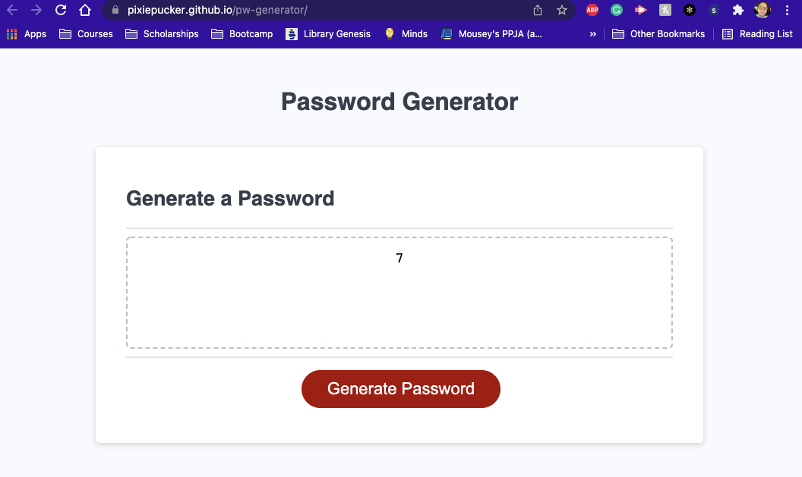

# Password Generator
This week's challenge was to build a script.js file for a password generator website. I was able to put some concepts from Module 3 into action, but failed to render a full password. 

I struggled a lot this week during the module and especially during the challenge. It felt like I was just following directions and not absorbing anything. This is most likely apparent in the way I structured my challenge script file. There are some things that come easier now like if else statements, prompt()/confirm(), etc. However, I still failed to determine password length from user input and how to generate more than one character from my selectedCharacters array. 

- Overall I was able to:
    - create a function with nested functions in order to add to my selectedCharacter array
    - create arrays to store my character info
    - generate one random character from my array

I can't say that I enjoyed this week's module or challenge. I hope that with review and feedback I can at least figure out what I did wrong. You can find my deployed application [here.](https://pixiepucker.github.io/pw-generator/)

## Preview of Website

### Credits
Scenario and instruction provided by UTSA's Trilogy Coding Bootcamp.